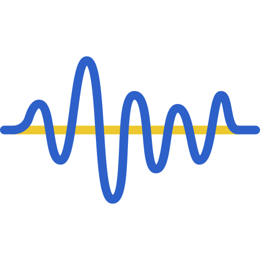

<h1 align="center">
  <!--  -->
 Taming Data and Transformers for Audio Generation
</h1>

### 🚀 Check Out Our Latest Work! 🎥🔊  
**[Video-to-Audio and Audio-to-Video Generation](https://snap-research.github.io/AVLink/)**  
Discover how we bridge the gap between video and audio generative models! 

This is the official GitHub repository of the paper Taming Data and Transformers for Audio Generation.


**[Taming Data and Transformers for Audio Generation](https://snap-research.github.io/GenAU)**
</br>
[Moayed Haji-Ali](https://moayedha.com/),
[Willi Menapace](https://www.willimenapace.com/),
[Aliaksandr Siarohin](https://aliaksandrsiarohin.github.io/aliaksandr-siarohin-website/),
[Guha Balakrishnan](https://www.guhabalakrishnan.com),
[Sergey Tulyakov](http://www.stulyakov.com/)
[Vicente Ordonez](https://vislang.ai/),
</br>
*Arxiv 2024*

[](https://snap-research.github.io/GenAU) [](https://arxiv.org/abs/2406.19388) [](https://paperswithcode.com/sota/audio-captioning-on-audiocaps?p=taming-data-and-transformers-for-audio-1)[](https://paperswithcode.com/sota/audio-generation-on-audiocaps?p=taming-data-and-transformers-for-audio-1)


# Introduction

<div align="justify">
<div>

</div>
</br>
Generating ambient sounds is a challenging task due to data scarcity and often
insufficient caption quality, making it difficult to employ large-scale generative
models for the task. In this work, we tackle this problem by introducing two
new models. First, we propose AutoCap , a high-quality and efficient automatic
audio captioning model. By using a compact audio representation and leveraging
audio metadata, AutoCap substantially enhances caption quality, reaching a CIDEr
score of 83.2, marking a 3.2% improvement from the best available captioning
model at four times faster inference speed. Second, we propose GenAu, a scalable
transformer-based audio generation architecture that we scale up to 1.25B parameters. Using AutoCap to generate caption clips from existing audio datasets, we
demonstrate the benefits of data scaling with synthetic captions as well as model
size scaling. When compared to state-of-the-art audio generators trained at similar
size and data scale, GenAu obtains significant improvements of 4.7% in FAD
score, 22.7% in IS, and 13.5% in CLAP score, indicating significantly improved
quality of generated audio compared to previous works. Moreover, we propose an
efficient and scalable pipeline for collecting audio datasets, enabling us to compile
57M ambient audio clips, forming AutoReCap-XL, the largest available audio-text
dataset, at 90 times the scale of existing ones. For more details, please visit our <a href='https://snap-research.github.io/GenAU'>project webpage</a>.
</div> 
<br>


# Updates
- **2025.04.25**: Release GenAU-L-Full-HQ-Data model and add gradio demos.
- **2024.10.24**: Code released!
- **2024.06.28**: Paper released!


# Reproducibility and Comparison with GenAU
To facilitate easier comparison with GenAU, we provide in this google drive [link](https://drive.google.com/drive/folders/1Prq-wI1q2NLJeBW-UZ8OMcJ0OHLYfyND?usp=sharing) containing all AudioCaps test samples generated by the following GenAU models:

- GenAU-L-Full-HQ-Data (1.25B parameters) trained with AutoRecap-XL filtered with CLAP score of 0.4 (20.7M samples)
- GenAU-L-Autorecap (1.25B parameters) trained with AutoRecap (760k samples)
- GenAU-S-Autorecap (493M parameters) trained with AutoRecap (760k samples)
- GenAU-L-AC, 1.25B parameters model trained only on AudioCaps


# Setup
Initialize a [conda](https://docs.conda.io/en/latest) environment named genau by running:
```
conda env create -f environment.yaml
conda activate genau
```
# Dataset Preparation 
See [Dataset Preparation](./dataset_preperation/README.md) for details on downloading and preparing the AutoCap dataset, as well as more information on organizing your custom dataset.

# Audio Captioning (AutoCap)
See [GenAU](./AutoCap/README.md) README for details on inference, training, and evaluating our audio captioner AutoCAP.

# Audio Generation (GenAU)
See [GenAU](./GenAU/README.md) README for details on inference, training, finetuning, and evaluating our audio generator GenAU.


## Citation
If you find this paper useful in your research, please consider citing our work:
```
@misc{hajiali2024tamingdatatransformersaudio,
      title={Taming Data and Transformers for Audio Generation}, 
      author={Moayed Haji-Ali and Willi Menapace and Aliaksandr Siarohin and Guha Balakrishnan and Sergey Tulyakov and Vicente Ordonez},
      year={2024},
      eprint={2406.19388},
      archivePrefix={arXiv},
      primaryClass={cs.SD},
      url={https://arxiv.org/abs/2406.19388}, 
}
```
